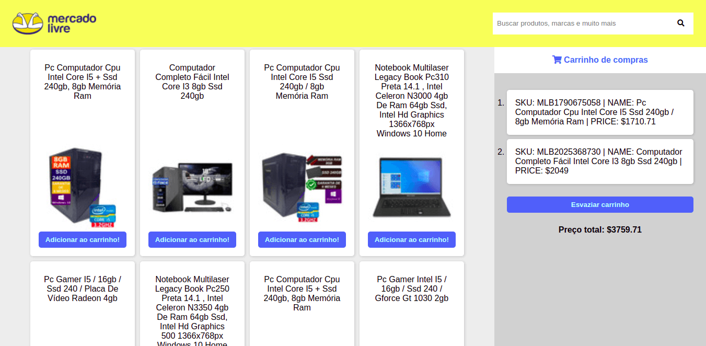

# Shopping Cart

Projeto feito de forma individual durante o curso da [Trybe](https://www.betrybe.com/) com o objetivo de criar um carrinho de compras com consumo de API.

## ⭐ Habilidades

- Utilizar as habilidades de Javascript, CSS e HTML.
- Consumir API's utilizando Fetch e inserindo informações no DOM.

## 🔧 Funçoes

- Pesquisar por produtos
- Adicionar produtos ao carrinho de compras
- Somar preço dos produtos
- Remover produtos do carrinho

## 💻 Como iniciar

1. Faça o clone do projeto
2. Entre no Visual Studio Code
3. Inicialize o projeto utilizando a extensão "Live Server"

## Feito Com:

### Contato

Copyright © 2021 Michael Caxias

